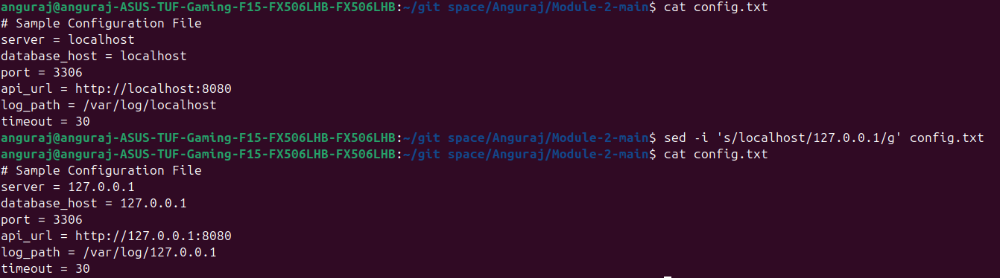
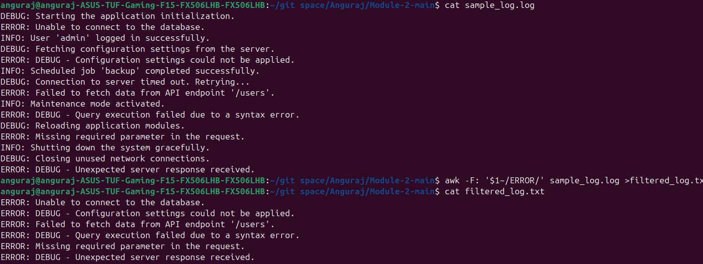
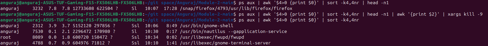
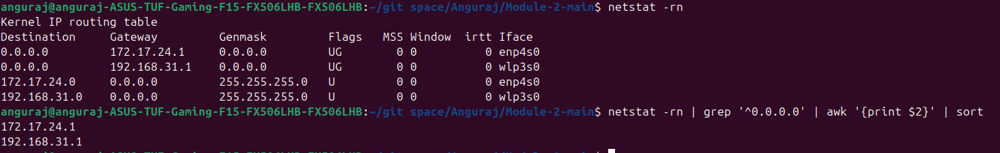

## Anguraj S - TCE

## Module 2 - Linux Commands and Networking

### 1. List All Files Larger Than 1 MB in the Current Directory and Save the Output to a File

#### Commands:
```bash
# List all files in the current directory
ls -l

# Filter the files with size greater than 1MB (1000000 bytes)
ls -l | awk '$5+0>1000000 {print $9}'
```

#### Output:


---

### 2. Replace All Occurrences of "localhost" with "127.0.0.1" in a Configuration File Named `config.txt`, and Save the Updated File as `updated_config.txt`

#### Commands:
```bash
# View the content of the configuration file
cat config.txt

# Replace all occurrences of "localhost" with "127.0.0.1"
sed 's/localhost/127.0.0.1/g' config.txt > updated_config.txt
```

#### Output:


---

### 3. Search for Lines Containing the Word "ERROR" in a Log File but Exclude Lines Containing "DEBUG". Save the Results to a File Named `filtered_log.txt`

#### Commands:
```bash
# View the content of the log file
cat sample_log.log

# Filter lines containing "ERROR" but not "DEBUG"
awk -F: '$1~/ERROR/ && $0 !~ /DEBUG/' sample_log.log > filtered_log.txt

# View the content of the filtered log file
cat filtered_log.txt
```

#### Output:


---

### 4. Identify the Process with the Highest Memory Usage and Terminate It

#### Commands:
```bash
# Display the process with the highest memory usage
ps aux | awk '$4>0 {print $0}' | sort -k4,4nr | head -n1

# Terminate the process consuming the highest memory
ps aux | awk '$4>0 {print $0}' | sort -k4,4nr | head -n1 | awk '{print $2}' | xargs kill -9
```

#### Output:


---

### 5. Print All the Gateways Available in a Sorted Manner Using Networking Tool Command

#### Commands:
```bash
# View the routing table to see network information
netstat -rn

# Print all gateways and sort them
netstat -rn | grep '^0.0.0.0' | awk '{print $2}' | sort
```

#### Output:


---

