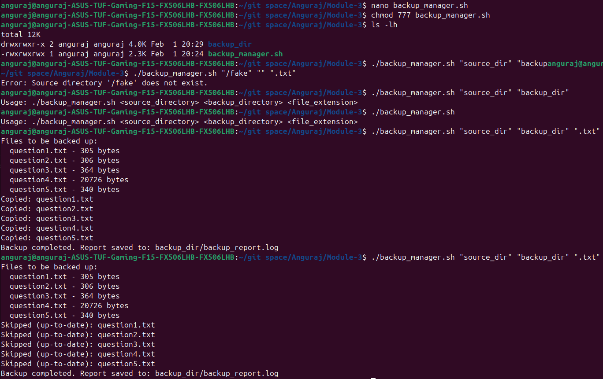

## Anguraj S - TCE 

## Module 3- Linux Distributions and Scripting Languages

### Scenario: Automating file backup and Reporting to the system. Create a shell script called "backup_manager.sh" that performs the following tasks incorporating the concepts suggested.

## Requirements:
### 1. Command-line Arguments and Quoting:
The script must accept three arguments: Source directory: A directory containing files to back up. Backup directory: The destination where files will be backed up. File extension: A specific file extension to filter (e.g., .txt).
Example:  ./backup_manager.sh "/home/user/source" "/backup" ".txt"

### 2. Globbing:
The script should use globbing to find all files in the source directory matching the provided file extension.
### 3. Export Statements:
Use export to set an environment variable BACKUP_COUNT, which tracks the total number of files backed up during the script execution.
### 4. Array Operations:
Store the list of files to be backed up in an array.
Print the names of these files along with their sizes before performing the backup.
### 5. Conditional Execution:
If the backup directory does not exist, create it. If creation fails, exit with an error.
If the source directory is empty or contains no files matching the extension, exit with a message.
If a file already exists in the backup directory with the same name, only overwrite it if it is older than the source file (compare timestamps).
### 6. Output Report:
After the backup, generate a summary report displaying:
Total files processed.
Total size of files backed up.
The path to the backup directory.
The report should be saved in the backup directory as backup_report.log.

#### Output:

