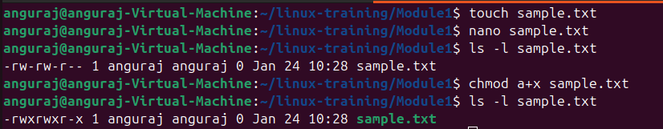
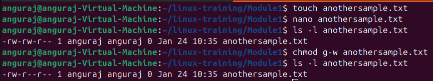
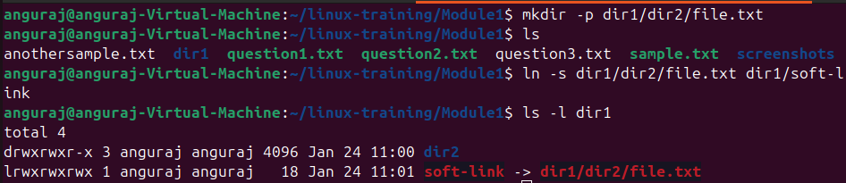
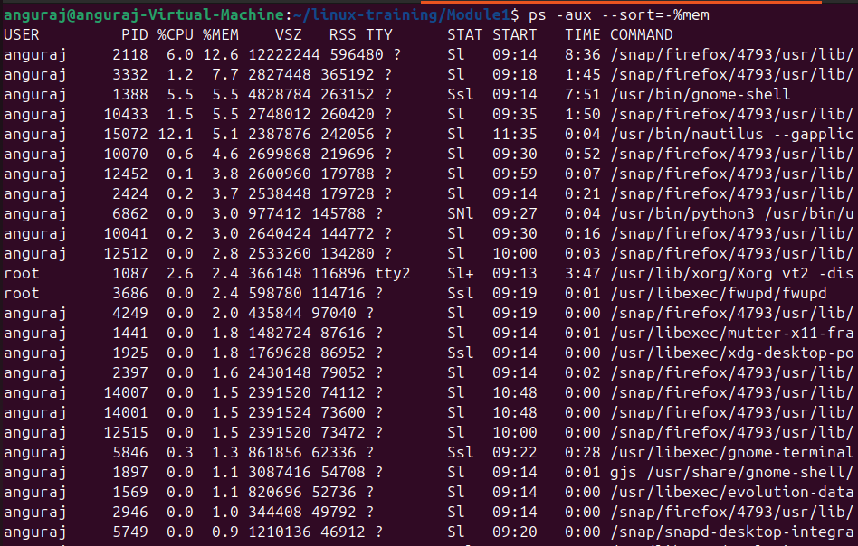
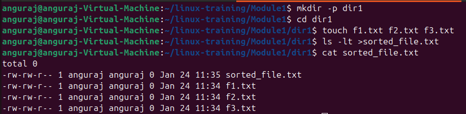

##Anguraj S - TCE 

## Module 1- Introduction to Linux OS, Architecture and Kernel

### 1. Create a File and Add Executable Permissions to All Users

#### Commands:
```bash
# Create a file
touch sample.txt

# Edit the file content in the editor
nano sample.txt

# Add executable permissions for all users
chmod a+x sample.txt

# Check the permissions given to the file
ls -l sample.txt
```

#### Output:


### 2. Create a File and Remove Write Permission for Group User Alone

#### Commands:
```bash
# Create a new file
touch anothersample.txt

# Edit the content of the file in the editor
nano anothersample.txt

# Remove write permission from group user alone
chmod g-w anothersample.txt

# Verify the permissions
ls -l anothersample.txt
```

#### Output:


### 3. Create a File and Add a Soft Link to It in a Different Directory

#### Commands:
```bash
# Create `file.txt` inside `dir2` within `dir1` in the current directory
mkdir -p dir1/dir2 && touch dir1/dir2/file.txt

# Create a soft link for `file.txt` in `dir1`
ln -s dir1/dir2/file.txt dir1/soft-link

# Verify the soft link
ls -l dir1
```

#### Output:


### 4. Display All Active Processes Running on the System

#### Commands:
```bash
# Display active processes in the whole system sorted in descending order based on memory
ps aux --sort=-%mem
```

#### Output:


### 5. Create Three Files and Redirect Sorted Output of `ls` Command

#### Commands:
```bash
# Create `dir1`
mkdir -p dir1
cd dir1

# Create three files in `dir1`
touch f1.txt f2.txt f3.txt

# List files sorted by timestamp and redirect output to a file
ls -lt >sorted_file.txt

# View the output
cat sorted_file.txt
```

#### Output:

