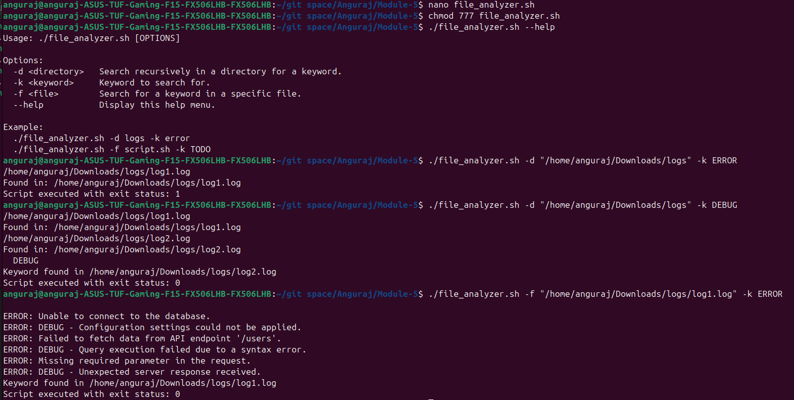

## Anguraj S - TCE 

## Module 5 - Advance topics in a function

Create a Bash script 'file_analyzer.sh', to demonstrate the following concepts:
1. Recursive functions
- Write a recursive function to search for files in a directory and its subdirectories containing a specific keyword.
2. Redirection and error handling
- Log errors (e.g., invalid arguments, missing files) to 'errors.log' and display them in the terminal.
3. Here document and here string
- Use a here document to display a help menu when the '--help' option is passed.
- Search for a keyword in a specified file using a here string
4. Special parameters
- Use parameters like '$0', '$#', '$?' and '$@' to provide meaningful feedback.
5. Regular expressions
- Validate inputs with regular expressions (Check if the file exists and the keyword is not empty and valid)
6. Command-line arguments using getopts
- Use 'getopts' to handle:
'-d <directory>': Directory to search.
'-k <keyword>': Keyword to search.
'-f <file>': File to search directly.
'--help': Display the help menu.

Example usage:

# Recursively search a directory for a keyword
./file_analyzer.sh -d logs -k error
# Search for a keyword in a file
./file_analyzer.sh -f script.sh -k TODO
# Display the help menu
./file_analyzer.sh --help

#### Output:

