# Anguraj S - TCE
# Networking Course Assignment - Module 1 & 2
## QUESTION NO: 01
### Consider a case, a folder has multiple files and how would copy it to destination machine path (Try using SCP, cp options in Linux)

### **Using SCP (Secure Copy Protocol)**
```bash
scp -r /path/to/source_folder username@destination_IP:/path/to/destination
```
- Example:
  ```bash
  scp -r ~/Documents/my_folder user@192.168.1.100:/home/user/
  ```
  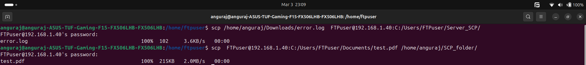

### **Using SCP (Secure Copy Protocol) to copy the error.log file from local machine onto the remote machine 192.168.1.40**
```bash
scp/home/anguraj/Downloads/error.log FTPuser@192.168.1.40:C:/Users/FTPuser/Server_SCP/
```
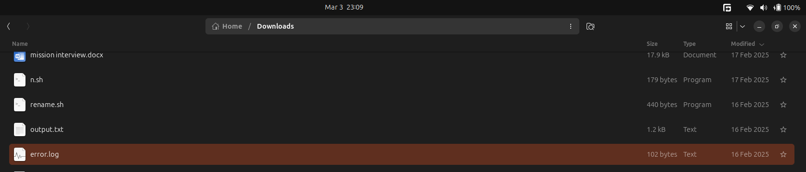
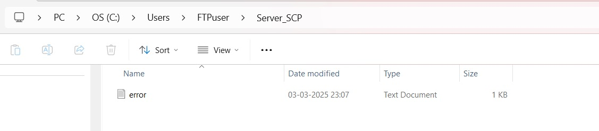

### **Using SCP (Secure Copy Protocol) to copy the test.pdf file from remote machine onto the local machine**
```bash
scp FTPuser@192.168.1.40:C:/Users/FTPuser/Documents/test.pdf/home/anguraj/SCP_folder/
```

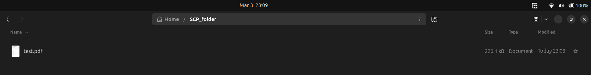

### **Using `cp` for Local Copies**
```bash
cp -r /source_folder /destination_folder
```

---

## QUESTION NO: 02
### Host a FTP and SFTP server and try PUT and GET operations

#### 1. FTP

- Start FTP server  
  `sudo systemctl enable --now vsftpd`

- Check the status using  
  `systemctl status vsftpd`

- Connect to FTP server (to access another user within same system ) using  
  `ftp localhost`

- Use PUT to upload files and GET to download files

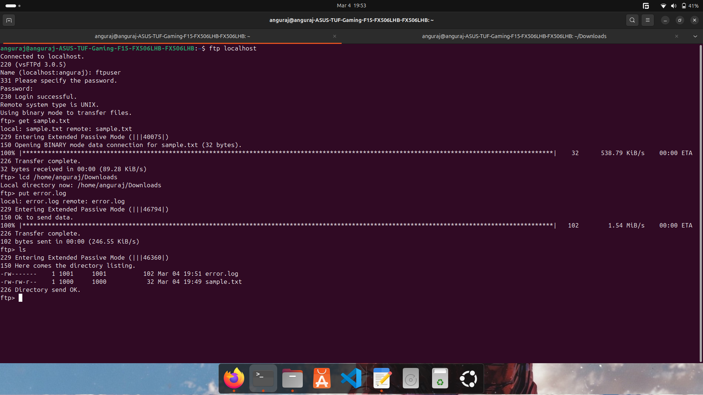
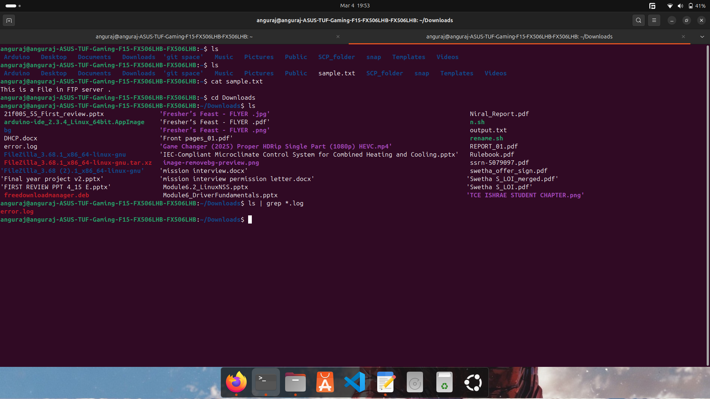

#### 2. SFTP

- Enable SSH server to which client needs to be connected
- Connect to the server with the following command  
  `sftp localhost`
- Enter the password
- In order to download a file use GET
- In order to upload a file use PUT

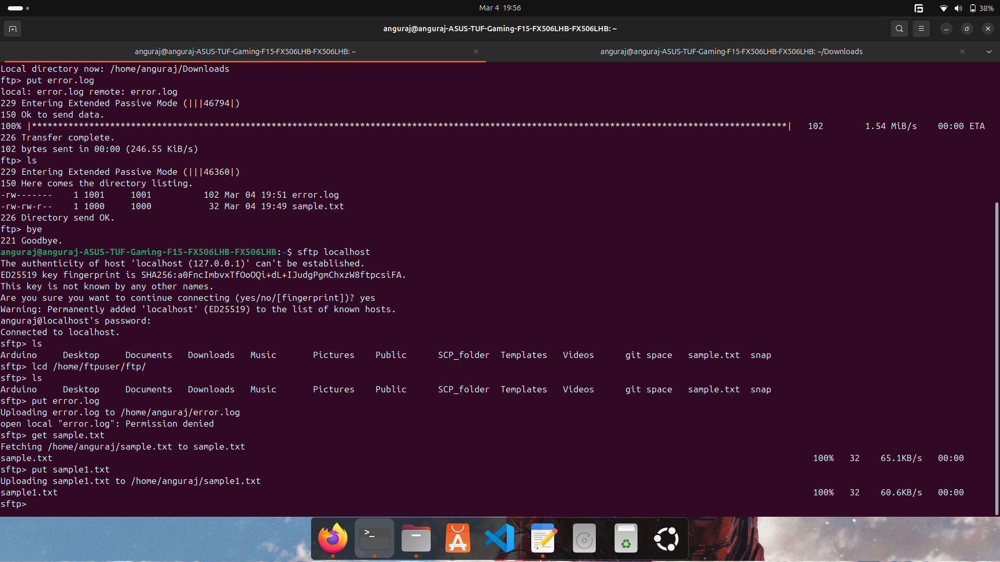


---
## QUESTION NO: 03
### Explore with Wireshark/TCP-dump/cisco packet tracer tools and learn about packet filters.

#### **1. TCPDUMP**
Network CLI utility to sniff network packets

**Options:**
1. `-D` - Check available interfaces  
   `sudo tcpdump -D`
2. `-c` - Limit the number of packets captured
3. `-i` - Capture on a specific interface
4. `-dst` - Filter packets based on destination IP
5. `-src` - Filter packets based on source IP
6. `-v` - Verbose output

Examples:
- `sudo tcpdump -D`  - List available interfaces
- `sudo tcpdump -c 5`  - Limit the number of packets captured
- `sudo tcpdump -i eth0`  - Capture on a specific interface
- `sudo tcpdump port 80`  - Capture HTTP packets
- `sudo tcpdump ICMP`  - Capture ICMP packets

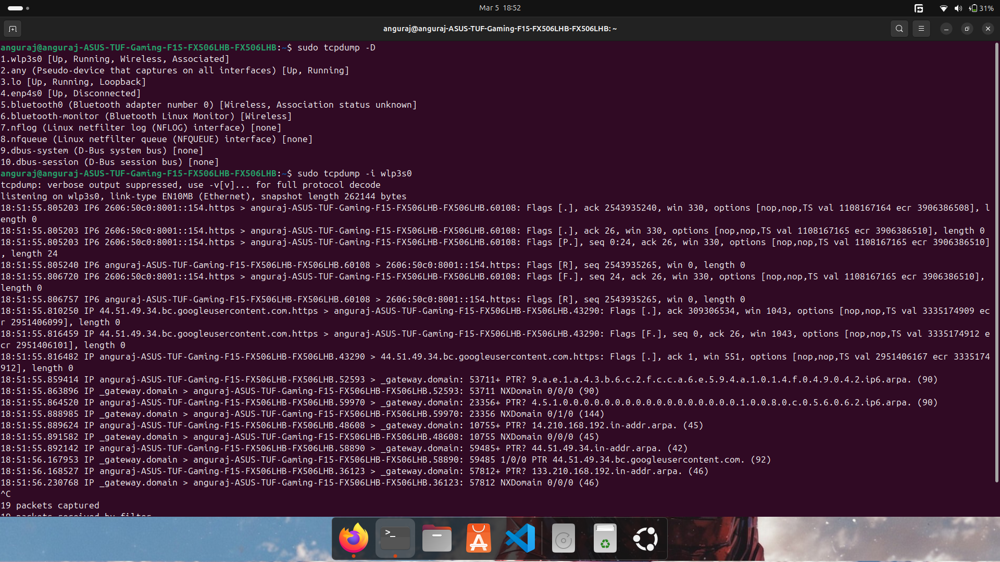

#### **2. Wireshark**
Apply packet filters such as:
- `ip.addr == 10.0.0.1` - Filter packets from this IP
- `tcp.port == 4000` - Filter packets on port 4000
- `http or dns or icmp` - Specify protocol-based filtering

---
## QUESTION NO: 04
### Understand Linux utility commands like ping, arp, ifconfig

#### 1. Ping
Tests network reachability using ICMP echo requests.

Examples:
- `ping google.com`  - Check connectivity
- `ping -c 10 google.com`  - Send 10 ping requests

#### 2. Arp
Manages ARP cache, mapping IP addresses to MAC addresses.

Examples:
- `arp -a`  - View ARP entries
- `arp -d 192.168.1.2`  - Delete an entry

#### 3. IFCONFIG
CLI tool to manage network interfaces.

Examples:
- `ifconfig -a`  - Show all network interfaces
- `ifconfig eth0 up`  - Enable an interface
- `ifconfig eth0 mtu 1500`  - Set MTU size

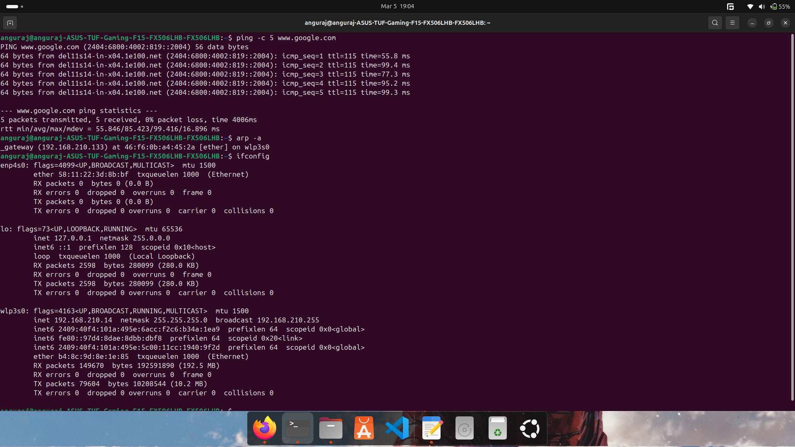
---
## QUESTION NO: 05
### What happens when duplicate IP addresses are assigned?

Duplicate IP addresses cause:
- Connectivity issues
- Packet misrouting or drops
- Troubleshooting complications

**Prevention Methods:**
- Use DHCP for automatic assignments
- Reserve static IPs
- Regular audits of IP assignments

---
## QUESTION NO: 06
### Access remote systems using VNC Viewer, Anydesk, TeamViewer, and RDP

#### 1. **VNC Viewer**
- Install VNC Server on remote and VNC Viewer on local machine
- Configure server with a password
- Connect via VNC Viewer

#### 2. **Anydesk**
- Install Anydesk
- Obtain remote device's access code
- Connect using the code

#### 3. **TeamViewer**
- Install TeamViewer on both devices
- Obtain unique ID and password
- Connect using the credentials

#### 4. **Remote Desktop Connection (RDP)**
- Enable Remote Desktop on Windows
- Connect using Windows RDP or macOS/Linux RDP clients

---
## QUESTION NO: 07
### Check if default gateway is reachable

1. Find default gateway IP:
   - `netstat -rn`
   - `ip route | grep default`
2. Check connectivity:
   - `ping gateway_ip`
   
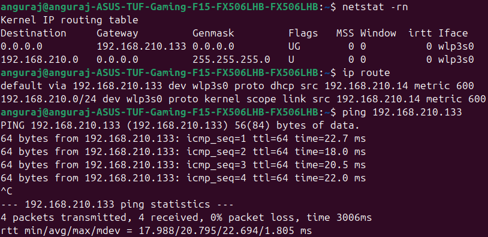

---
## QUESTION NO: 08
### Check iwconfig/ifconfig for network interface details

#### **iwconfig** (Wireless interfaces)
Displays:
- Bit rate, Transmission power, Signal level, Access point MAC

#### **ifconfig** (All interfaces)
Displays:
- MTU, MAC address, IP address, RX/TX packets, Errors

---
## QUESTION NO: 09
### Log in to home router's web interface and check connected devices

1. Open `192.168.1.1` or `192.168.0.1` in a browser.
2. Enter admin credentials.
3. Navigate to `Status -> User Information`.
4. View connected devices and details such as MAC address, Tx/Rx count, lease time.
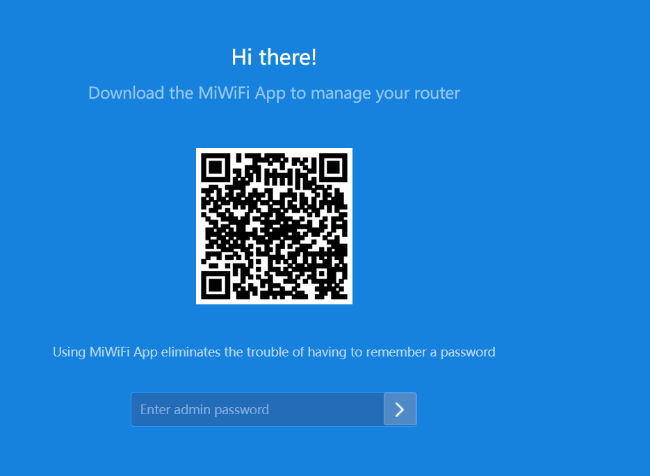
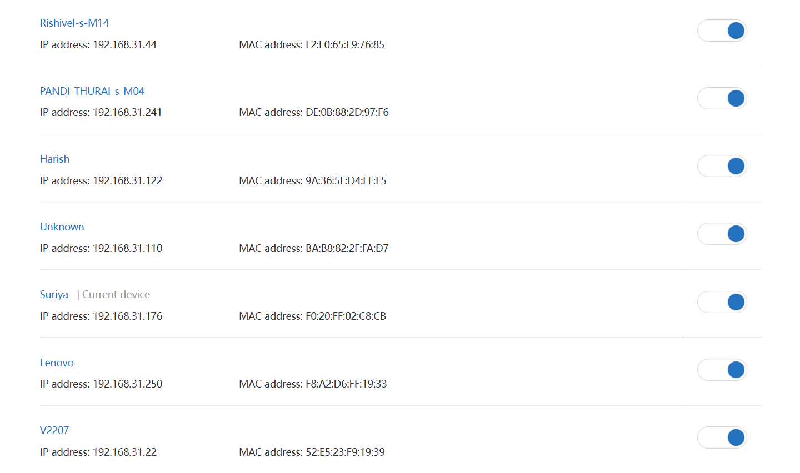

---
## QUESTION NO: 10
### How DHCP assigns IP addresses in a network

#### **Process:**
1. **DHCP Discover:** Client requests an IP.
2. **DHCP Offer:** Server offers an available IP.
3. **DHCP Request:** Client requests the offered IP.
4. **DHCP Acknowledgment:** Server assigns the IP.

This process ensures efficient and conflict-free IP assignment in a network.

---
## QUESTION NO: 11
### Using a terminal, connect to a remote machine via SSH and telnet.
## **Enable Telnet in Windows (Client & Server)**

### **1. Enable Telnet Client (On the Client Machine)**
```powershell
# Open PowerShell as Administrator and run:
dism /online /Enable-Feature /FeatureName:TelnetClient

# Verify installation
telnet
```

### **2. Set Up a Telnet Server (Using Python as remote machine is not available)**
#### **2.1 Save the Following Script as `telnet_server.py`**
```python
import socketserver, os

HOST, PORT = "0.0.0.0", 23
SHARED_FOLDER = os.path.dirname(os.path.abspath(__file__))

class TelnetHandler(socketserver.StreamRequestHandler):
    def handle(self):
        self.wfile.write(b"Welcome to Telnet Server!\nCommands: LIST, GET <filename>, EXIT\n")
        while True:
            self.wfile.write(b"telnet> ")
            command = self.rfile.readline().strip().decode()
            if command.upper() == "LIST":
                self.wfile.write("\n".join(os.listdir(SHARED_FOLDER)).encode() + b"\n")
            elif command.upper().startswith("GET "):
                filename = command[4:].strip()
                filepath = os.path.join(SHARED_FOLDER, filename)
                if os.path.isfile(filepath):
                    with open(filepath, "rb") as f:
                        self.wfile.write(f.read() + b"\n")
                else:
                    self.wfile.write(b"File not found.\n")
            elif command.upper() == "EXIT":
                break

with socketserver.TCPServer((HOST, PORT), TelnetHandler) as server:
    print(f"Telnet Server Running on {HOST}:{PORT}")
    server.serve_forever()
```

#### **2.2 Run the Server**
```powershell
python telnet_server.py
```

#### **2.3 Allow Port 23 in Firewall**
```powershell
New-NetFirewallRule -DisplayName "Allow Telnet" -Direction Inbound -Protocol TCP -LocalPort 23 -Action Allow
```

### **3. Connect from Another Machine (Client)**
#### **3.1 Find Server IP**
```powershell
ipconfig
```
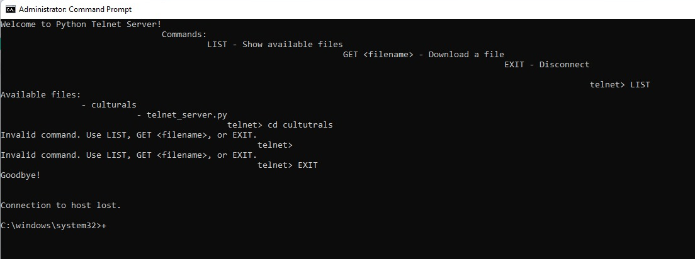

#### **3.2 Connect via Telnet**
```powershell
telnet <server_ip>
```

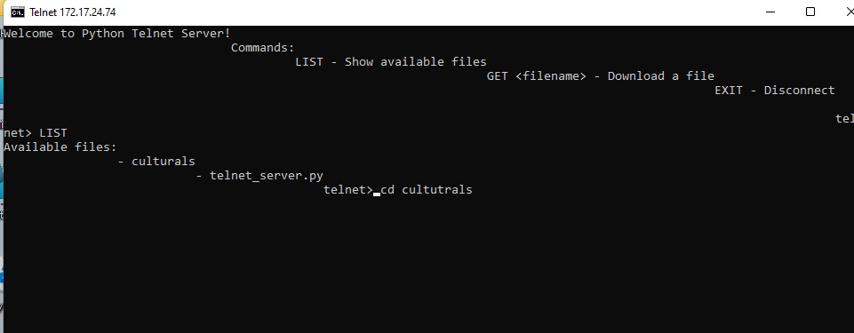


---

