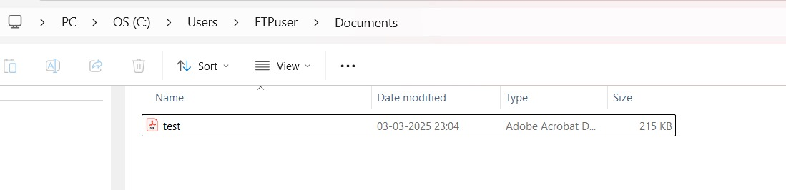

# Anguraj S - TCE
# Networking Course Assignment - Module 1 & 2
## QUESTION NO: 01
### Consider a case, a folder has multiple files and how would copy it to destination machine path (Try using SCP, cp options in Linux)

### **Using SCP (Secure Copy Protocol)**
```bash
scp -r /path/to/source_folder username@destination_IP:/path/to/destination
```
- Example:
  ```bash
  scp -r ~/Documents/my_folder user@192.168.1.100:/home/user/
  ```
  

### **Using SCP (Secure Copy Protocol) to copy the error.log file from local machine onto the remote machine 192.168.1.40**
```bash
scp/home/anguraj/Downloads/error.log FTPuser@192.168.1.40:C:/Users/FTPuser/Server_SCP/
```


### **Using SCP (Secure Copy Protocol) to copy the test.pdf file from remote machine onto the local machine**
```bash
scp FTPuser@192.168.1.40:C:/Users/FTPuser/Documents/test.pdf/home/anguraj/SCP_folder/
```



### **Using `cp` for Local Copies**
```bash
cp -r /source_folder /destination_folder
```

---

## QUESTION NO: 02
### Host a FTP and SFTP server and try PUT and GET operations

#### 1. FTP

- Start FTP server  
  `sudo systemctl enable --now vsftpd`

- Check the status using  
  `systemctl status vsftpd`

- Connect to FTP server (to access another user within same system ) using  
  `ftp localhost`

- Use PUT to upload files and GET to download files


#### 2. SFTP

- Enable SSH server to which client needs to be connected
- Connect to the server with the following command  
  `sftp localhost`
- Enter the password
- In order to download a file use GET
- In order to upload a file use PUT


---
## QUESTION NO: 03
### Explore with Wireshark/TCP-dump/Cisco Packet Tracer tools and learn about packet filters.

- **Wireshark**: A GUI-based network protocol analyzer that allows users to capture and inspect packets in real-time. Users can apply display filters (e.g., `ip.addr == 192.168.1.1`) to analyze specific packets.
- **tcpdump**: A command-line tool for packet capturing. Example usage:
  ```bash
  sudo tcpdump -i eth0 port 80
  ```
- **Cisco Packet Tracer**: A network simulation tool used for designing and testing network configurations virtually. It allows users to filter packets based on protocols and IP addresses.

---
## QUESTION NO: 04
### Understand Linux utility commands like ping, arp, ifconfig

- **ping**: Sends ICMP Echo requests to check connectivity.
  ```bash
  ping 8.8.8.8
  ```
- **arp**: Displays or modifies the ARP table.
  ```bash
  arp -a
  ```
- **ifconfig**: Displays or configures network interfaces (deprecated in favor of `ip` command).
  ```bash
  ifconfig eth0
  ```

---
## QUESTION NO: 05
### What happens when duplicate IP addresses are assigned?

- Causes IP conflicts, leading to network disconnections.
- Devices may experience connectivity issues and errors.
- Network administrators use tools like `arp -a` or Wireshark to detect conflicts.

---
## QUESTION NO: 06
### Access remote systems using VNC Viewer, AnyDesk, TeamViewer, and RDP

- **VNC Viewer**: Connects to remote desktops over VNC protocol.
- **AnyDesk** & **TeamViewer**: Cross-platform remote desktop applications.
- **RDP (Remote Desktop Protocol)**: Used to access Windows machines remotely.
  ```bash
  rdesktop <remote-IP>
  ```

---
## QUESTION NO: 07
### Check if default gateway is reachable

- Use `ping` command to test gateway connectivity:
  ```bash
  ping <default-gateway-IP>
  ```
- Use `ip route` to find the default gateway:
  ```bash
  ip route | grep default
  ```

---
## QUESTION NO: 08
### Check iwconfig/ifconfig for network interface details

- **iwconfig**: Used for wireless interface details.
  ```bash
  iwconfig wlan0
  ```
- **ifconfig**: Displays wired and wireless network interface information.
  ```bash
  ifconfig eth0
  ```

---
## QUESTION NO: 09
### Log in to home router's web interface and check connected devices

- Find router IP using:
  ```bash
  ip route | grep default
  ```
- Access router via web browser: `http://<router-IP>`
- Check DHCP client list or connected devices in router settings.

---
## QUESTION NO: 10
### How DHCP assigns IP addresses in a network

- DHCP (Dynamic Host Configuration Protocol) assigns IP addresses dynamically.
- Steps:
  1. **Discovery**: Client broadcasts a DHCP request.
  2. **Offer**: DHCP server responds with an available IP.
  3. **Request**: Client requests the offered IP.
  4. **Acknowledgment**: Server assigns the IP and provides network settings (DNS, gateway).

---


